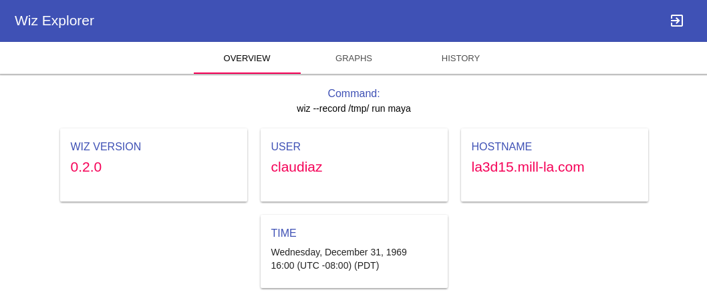
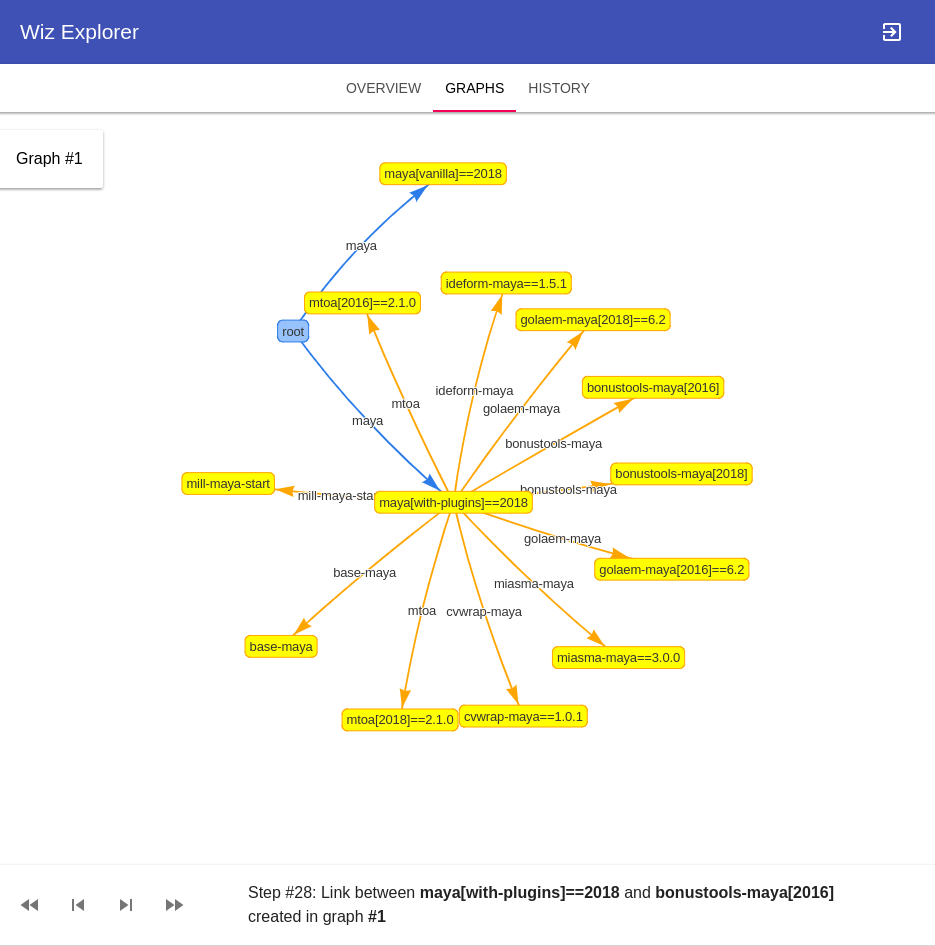
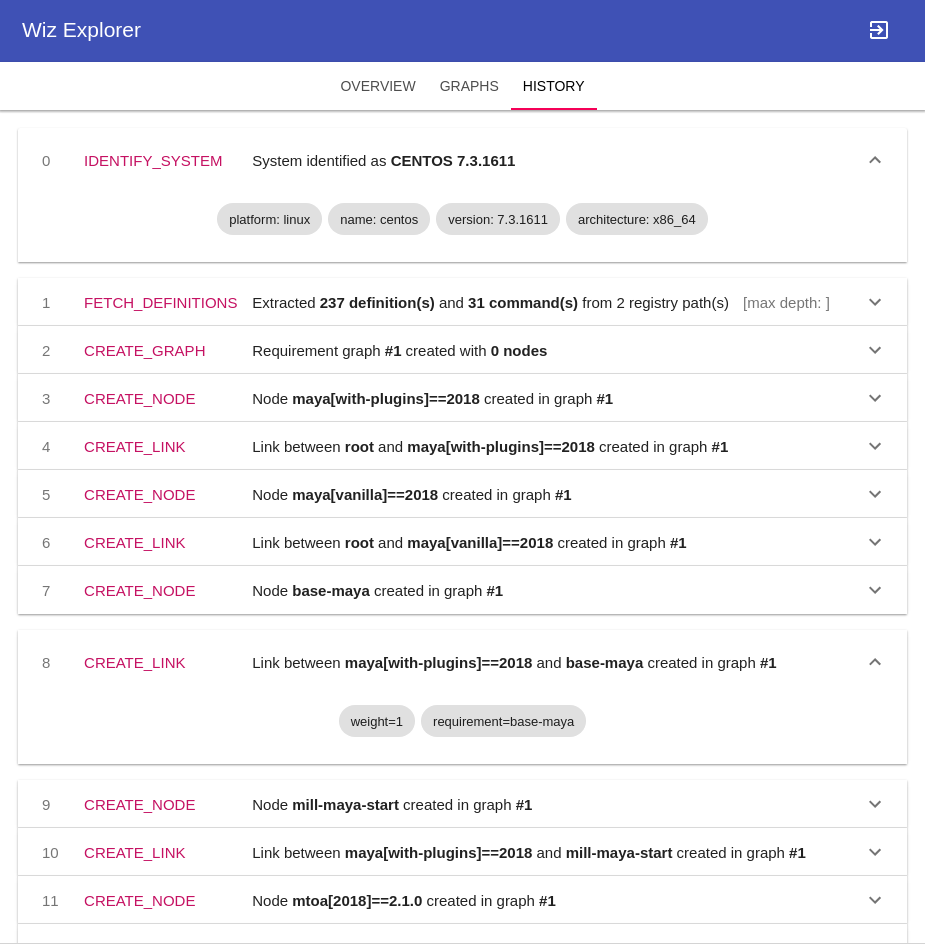
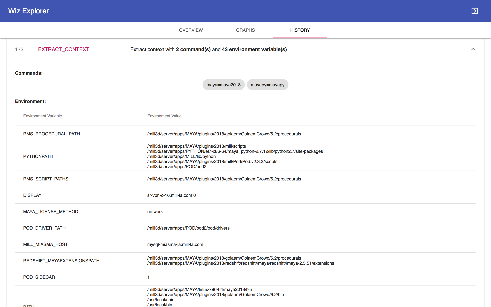

.. _tools:

*****
Tools
*****

.. _tools/wiz_explorer:

Wiz Explorer
============

The Wiz Explorer has been developed to ease debugging.
Since the graph created to resolve into environments can become rather large,
it is not always obvious why a package has been picked instead of another. To
be able to step through the resolution process and analyse potential errors
a visual representation was needed.

To start using the Wiz Explorer a dump file has to be created from Wiz. For
that the :option:`--record <wiz --record>` command is used. Any wiz command can
be called here and recorded into a dump file, i.e:

.. code-block:: console

    >>> wiz --record /tmp run my-command

To launch the Wiz Explorer, open a browser and navigate to::

    http://wiz.themill.com/explorer/

Here upload the dump file.

An overview page should appear, giving a summary of nodes created and conflicts
identified, etc:

Another tab shows the graph and allows stepping through the resolution process:

A third tab shows a history of steps taken to build and resolve the graph:

At the very bottom of the history a summary shows the extracted context with
all environment variables that have been set and all commands that can be
called in it. It also shows the exact packages (with versions) picked to create
this context.

